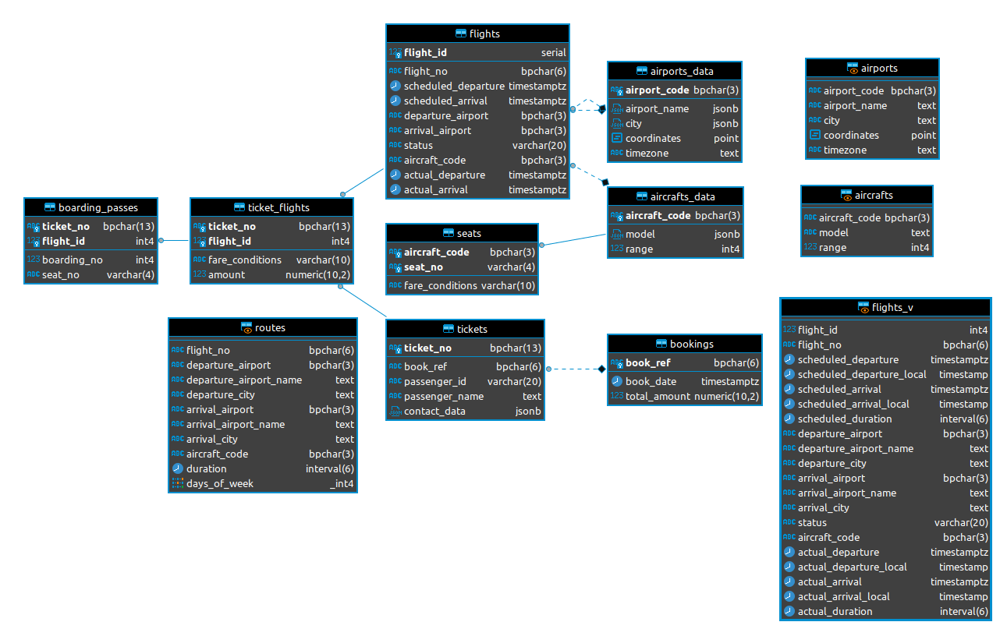
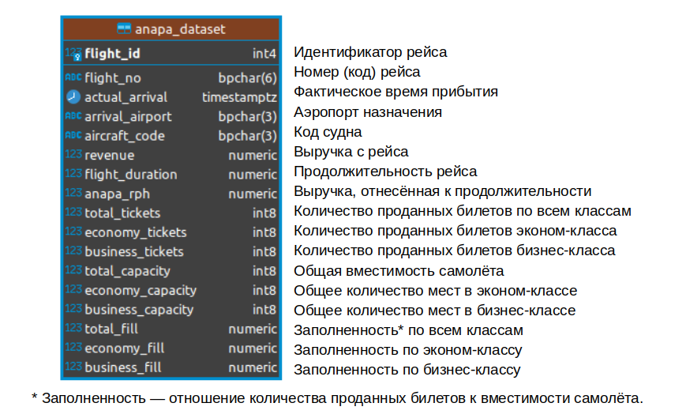

# Проект 4. "Авиарейсы без потерь."
**Автор - Михаил Пустовалов**
Этот проект посвящен работе с базой данных, доступной по ссылке https://edu.postgrespro.ru/demo-big.zip. \
База включает в себя данные о рейсах некоей авиакомпании, о билетах, парке самолётов и т.д. Структура исходной базы представлена ниже.

Задача проекта - сформировать датасет и провести анализ прибыльности рейсов, совершаемых из Анапы в зимнее время и определить, какие из этих рейсов можно отменить.

Файл Real_DST-EXPLORATION_SQL_script.sql содержит скрипты для ответа на вопросы первой части проекта.

Файл Real_DST-DATASET_CREATION.sql - скрипт для создания датасета в виде таблиц в базе. Инструкция по установке базы - внутри скрипта.

Файл Flights data analysis.ipynb - ноутбук с анализом полученного датасета. Также в ноутбук встроены все скрипты для установки базы и SQL-скрипт, аналогичный тому, что в файле SQL.

Результирующий датасет состоит из двух таблиц. Одна из них для рейсов из Анапы за зимние месяцы 2017 года, в другом - аналогичные данные для других городов. Струткура таблицы для Анапы представлена ниже, структура таблицы для других городов аналогична, но включает в себя ещё и аэропорт вылета.

## Выводы.

1) Нужна перепроверка рейсов в Новокузнецк. В базе нет данных о проданных билетах на этот рейс. Если и правда туда не летают, то их, конечно, надо отменить.\
2) Возможна отмена московского рейса по воскресеньям, но только при наличии достойных альтернатив для высвободившегося времени у самолёта (на земле он стоит в минус в любом случае)\
3) Отменяя рейс нужно куда-то девать самолёт и экипаж, т.е. переводить их на другой рейс. Значит, нужна более выгодная альтернатива. Например, рейс в среду, несмотря на второе с конца место по прибыльности, навряд ли будет иметь более выгодную альтернативу, т.к. в среднем выручка по другим рейсам этого самолёта заметно ниже.\
4) С другой стороны, рейс в чтетверг такую альтернативу может иметь, потому что не намного более выгоден, чем средний по типу судна.\
5) С рейсами в Белгород нужно что-то делать. Отмена части выглядит нерациональной из-за высокой заполненности рейса - в целом направление пользуется спросом. Поэтому повышение цен на этом направлении выглядит более эффективно. 

ИТОГ: 
1) Предлагается отменить рейс в Москву по воскресеньям и по четвергам (последний - при наличии достойных альтенатив, поиск которых не входит в данный анализ).\
2) Новокузнецким рейсам нужна перепроверка, подозрительно, что никто на них не летает. Если правда пассажиров нет, то весь маршрут на Новокузнецк надо отменять.\
3) Рейсы в Белгород пользуются популярностью, но не приносят большой прибыли. Возможно, стоит повысить на них цены.\