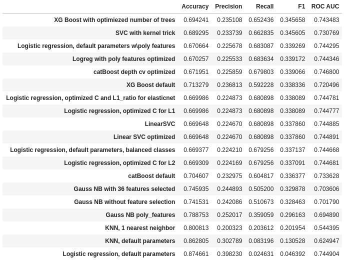

## Проект 5. "Банковский скоринг."
**Автор - Михаил Пустовалов**\
Этот проект посвящен определению риска дефолта потенциального заёмщика на основании определённых данных о нём.
В качестве датасета взята условная обучающая выборка на 73799 записей.
В папке input лежат обе выборки (обучающая выборка в файле train.csv, валидационная - test.csv).
Целевой метрикой в соревновании является ROC AUC, однако как будет показано в проекте "хорошее" значение этой метрики не является залогом успешного решения задачи.

[Блокнот на kaggle](https://www.kaggle.com/mikhailpustovalov/sf-dst-credit-scoring)\
[Соревнование на kaggle](https://www.kaggle.com/c/sf-dst-scoring)

**Структура** выборок:
* client_id - идентификатор клиента
* education - уровень образования
* sex - пол заемщика
* age - возраст заемщика
* car - флаг наличия автомобиля
* car_type - флаг автомобиля иномарки
* decline_app_cnt - количество отказанных прошлых заявок
* good_work - флаг наличия “хорошей” работы
* bki_request_cnt - количество запросов в БКИ
* home_address - категоризатор домашнего адреса
* work_address - категоризатор рабочего адреса
* income - доход заемщика
* foreign_passport - наличие загранпаспорта
* sna - связь заемщика с клиентами банка
* first_time - давность наличия информации о заемщике
* score_bki - скоринговый балл по данным из БКИ
* region_rating - рейтинг региона
* app_date - дата подачи заявки
* default - флаг дефолта по кредиту - есть только обучающая.

При разведывательном анализе данных проведены следующие **действия:**

1. EDA с заполнением пропусокв, анализом распределений, принятием решений о той или иной обработке фичей, генерация новых признаков, разделение выборки на обучающую и валидационную части (тестовая предоставлена отдельно).
2. Написание пайплайнов для обработки данных.
3. Обучение и кросс-валидация моделей наивного байесовского классификатора, k ближайших соседей.
4. Обучение и кросс-валидация моделей логистической регрессии и метода опорных векторов, подбор гиперпараметров.
5. Обучение и кросс-валидация моделей xgboost и catboost.

В результате работы сформулированы следующие **выводы:**

1. Из рассмотренных методов классификации наименее эффективными оказались методы наивного байесовского классификатора и kNN.
2. В целом эффективность логистичесокй регрессии и методов, основанных на деревьях и бустинге, в *данной задаче* показывают схожую эффективность.
3. Очень важно понимание о сбалансированности классов или об их пропорции.
4. Метрика ROC AUC, как и все остальные, не может быть единственной метрикой качества модели. Необходимо рассматривать комплекс метрик (ROC AUC + precision + recall + f1 score и т.д.)
5. Кросс-валидация позволяет настроить гиперпараметры для оптимального решения.
   

В репозитории хранятся файлы:

1. readme.md - этот файл  
2. [SF-DST] Credit Scoring.ipynb - собственно ноутбук проекта
3. /inputs/train.csv - обучающая выборка
4. /inputs/test.csv - тестовая выборка
5. /outputs/*.csv - предсказания различных моделей для сабмита